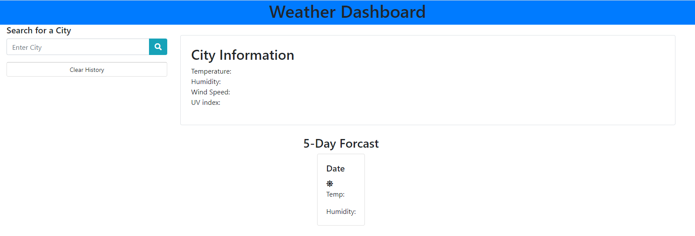

# Weather Dashboard

## Description
The objective of this project is to have an application where users can search for the current weather and view a 5-day forcast of the city of their choice. The city will be stored in a local storage and will clear when the button Clear History is clicked.

## Usage
Below is a screenshot of the landing page. The link for the repository https://github.com/CorgiPower11/weather-dashboard. Click here to deploy the webpage: https://corgipower11.github.io/weather-dashboard/.
    